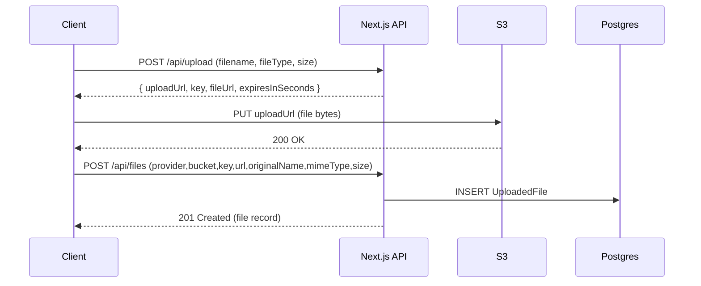

# School Management System (SMS)

Next.js (TypeScript) + Prisma + PostgreSQL + Redis starter for a school management system.

## Folder Structure

This project uses the standard Next.js + TS layout:

- `src/app` – App Router (pages/layouts/routes)
- `src/components` – UI components
- `src/lib` – shared libraries (Prisma, env, JWT, response helpers)

## Environment Variables

- Local dev file: `.env.local` (ignored)
- Template: `.env.example` (committed)

Server-only variables (do NOT prefix with `NEXT_PUBLIC_`):

- `DATABASE_URL`
- `REDIS_URL`
- `JWT_SECRET`

Client-safe variables:

- `NEXT_PUBLIC_API_BASE_URL`

## Local Development (Docker)

From the repo root:

```bash
docker-compose up -d
```

The app runs at http://localhost:3000.

## Local Development (No Docker)

```bash
cd sms
npm install
cp .env.example .env.local
npm run db:generate
npm run db:migrate
npx prisma db seed
npm run dev
```

## Scripts

```bash
npm run dev
npm run build
npm start

npm run lint
npm run format
npm run format:check
npm run typecheck

npm run db:generate
npm run db:migrate
npm run db:studio
```

## Global State Management (Context + Hooks)

This codebase uses React Context + custom hooks to share global state without prop-drilling.

### Folder structure

- `src/context/AuthContext.tsx` – authentication state (token, user) + actions (login/signup/logout)
- `src/context/UIContext.tsx` – UI state (theme + mobile sidebar) using a `useReducer` action pattern
- `src/hooks/useAuth.ts` – ergonomic wrapper around `useAuthContext()` (adds derived fields like `isAuthenticated`)
- `src/hooks/useUI.ts` – ergonomic wrapper around `useUIContext()` (adds derived fields like `isDark`)

For backward compatibility, existing imports like `@/components/auth/AuthProvider` continue to work (it re-exports the new context + hook).

### Providers

Global providers are mounted once in the app root via [sms/src/components/Providers.tsx](sms/src/components/Providers.tsx).

### State flow (examples)

- Auth flow:
  - `login()` calls `POST /api/auth/login` → stores token in `localStorage` → updates `AuthContext`
  - `logout()` calls `POST /api/auth/logout` → clears token → updates `AuthContext`
- UI flow:
  - `toggleTheme()` dispatches a reducer action → applies `html[data-theme]` → persists `sms_theme` in `localStorage`
  - `openSidebar()/closeSidebar()` dispatches reducer actions → `AppShell` reads `sidebarOpen` globally

### Evidence / debugging

- Dev-only console logs are emitted on auth + UI transitions (e.g., `[auth] login`, `[ui] toggleTheme`).
- Use React DevTools → Components to inspect `AuthProvider` / `UIProvider` values.

### Performance notes

- Context values are memoized to limit unnecessary re-renders.
- UI state uses a reducer for predictable transitions and easier debugging.
- Avoid putting high-frequency values (like keystrokes) into global context unless necessary.

## API Routes

Routes live under `src/app/api`:

- `POST /api/auth/signup`
- `POST /api/auth/login`
- `POST /api/auth/logout`
- `GET /api/projects`
- `POST /api/projects`
- `GET /api/projects/:id`
- `GET /api/tasks`
- `POST /api/tasks`
- `GET /api/tasks/:id`
- `PATCH /api/tasks/:id`
- `GET /api/users/me`

- `POST /api/email` (authenticated) – send transactional email (SendGrid)

## App Router Routing (Public + Protected + Dynamic)

This project uses Next.js App Router (file-based routing under `src/app`).

### Route map

Public routes:

- `/` (home)
- `/login`
- `/signup`

Protected routes (via middleware + JWT cookie):

- `/dashboard`
- `/users`
- `/users/[id]` (dynamic)

Existing protected dashboard area:

- `/app` (client-side protected via `RequireAuth` + app shell)

### Middleware protection

Middleware is implemented in [sms/src/middleware.ts](sms/src/middleware.ts) and:

- Allows public routes
- For `/dashboard` and `/users/*`, requires a valid JWT stored in a `token` cookie
- Redirects unauthenticated users to `/login?next=<path>`

Auth cookie is set/cleared by the API routes:

- Login sets cookie: [sms/src/app/api/auth/login/route.ts](sms/src/app/api/auth/login/route.ts)
- Signup sets cookie: [sms/src/app/api/auth/signup/route.ts](sms/src/app/api/auth/signup/route.ts)
- Logout clears cookie: [sms/src/app/api/auth/logout/route.ts](sms/src/app/api/auth/logout/route.ts)

### Dynamic routes + breadcrumbs

- Users list: [sms/src/app/users/page.tsx](sms/src/app/users/page.tsx)
- User profile (dynamic): [sms/src/app/users/[id]/page.tsx](sms/src/app/users/[id]/page.tsx)

The dynamic user page renders a breadcrumb trail (Dashboard → Users → User) to improve navigation and provide clearer structure.

### 404 and error handling

- Custom 404 page: [sms/src/app/not-found.tsx](sms/src/app/not-found.tsx)
- Users error boundary: [sms/src/app/users/error.tsx](sms/src/app/users/error.tsx)

### SEO reflection

- Dynamic routes scale cleanly: you can add new users without changing the route table.
- Breadcrumbs and a predictable URL structure (`/users/[id]`) help both usability and SEO (clear hierarchy).
- `generateMetadata` in the dynamic route can set per-user titles/descriptions for better indexing.

### Screenshots checklist (for lesson deliverables)

- Home page (`/`)
- Redirect from `/dashboard` to `/login` when logged out
- Successful access to `/dashboard` when logged in
- Dynamic user pages: `/users/<id>` for at least 2 users
- Breadcrumbs visible on the user profile page
- Custom 404 for an unknown route (e.g., `/does-not-exist`)

### Secure file uploads (Pre-signed S3 URLs)

New routes:

- `POST /api/upload` – generate a short-lived pre-signed **PUT** URL
- `POST /api/files` – store uploaded file metadata in Postgres

## Forms (React Hook Form + Zod)

This codebase uses **Zod** for schema validation and **React Hook Form** for performant client-side form state.

### Why this combo

- React Hook Form minimizes re-renders and keeps form state ergonomic.
- Zod schemas provide reusable, type-safe validation rules.
- `@hookform/resolvers/zod` bridges Zod errors into RHF’s `formState.errors`.

### Example: Signup form

- Schema lives in [sms/src/types/auth.ts](sms/src/types/auth.ts)
- The page integrates RHF + `zodResolver` in [sms/src/app/(auth)/signup/page.tsx](<sms/src/app/(auth)/signup/page.tsx>)

Key idea: the **same Zod schema** can be reused on the server (API validation) and the client (form validation), reducing mismatched rules.

### Reusable field component

To avoid repeating input + error markup, a reusable field component is provided:

- [sms/src/components/FormInput.tsx](sms/src/components/FormInput.tsx)

It includes accessibility basics:

- `label` is linked via `htmlFor` + `id`
- invalid state uses `aria-invalid`
- error text uses `aria-describedby` pointing to an error element id

### Example: Contact form

- [sms/src/app/contact/page.tsx](sms/src/app/contact/page.tsx)

### Screenshots / evidence checklist (lesson deliverables)

- Signup page showing client-side validation errors
- Signup page showing a server error (e.g., duplicate email)
- Contact form showing validation errors + a successful submit state

### Reflection notes

- Compared to manual `useState` + hand-rolled validation, RHF + Zod is easier to maintain and scales across multiple forms.
- Storing validation rules in schemas keeps UI code clean and encourages reuse.
- Accessibility improves when labels + error descriptions are consistently wired.

Environment variables (server-only):

- `AWS_REGION`
- `AWS_BUCKET_NAME`
- `AWS_ACCESS_KEY_ID` (optional if using IAM roles)
- `AWS_SECRET_ACCESS_KEY` (optional if using IAM roles)
- `S3_PRESIGN_TTL_SECONDS` (default: 60)
- `UPLOAD_MAX_BYTES` (default: 10MB)

#### Upload flow



#### Example API responses

Generate URL (`POST /api/upload`):

```json
{
  "success": true,
  "statusCode": 201,
  "message": "Pre-signed upload URL generated",
  "data": {
    "uploadUrl": "https://...",
    "provider": "s3",
    "bucket": "your-bucket-name",
    "key": "uploads/<userId>/<uuid>-file.pdf",
    "fileUrl": "https://your-bucket-name.s3.ap-south-1.amazonaws.com/uploads/...",
    "expiresInSeconds": 60
  }
}
```

Store record (`POST /api/files`):

```json
{
  "success": true,
  "statusCode": 201,
  "message": "File record stored successfully",
  "data": {
    "id": "cl...",
    "provider": "s3",
    "bucket": "your-bucket-name",
    "key": "uploads/...",
    "url": "https://...",
    "originalName": "file.pdf",
    "mimeType": "application/pdf",
    "size": 12345,
    "uploaderId": "cl...",
    "createdAt": "2026-01-19T...Z"
  }
}
```

#### Security measures implemented

- **Type validation**: only `image/jpeg`, `image/png`, `image/webp`, `application/pdf` are allowed before issuing a URL.
- **Size validation**: `UPLOAD_MAX_BYTES` gate prevents oversized uploads from ever receiving a pre-signed URL.
- **Short-lived URLs**: `S3_PRESIGN_TTL_SECONDS` keeps the upload URL valid briefly (recommended 30–120s).
- **No secret exposure**: clients never receive AWS credentials.

#### Lifecycle policy (recommended)

Create an S3 lifecycle rule for the `uploads/` prefix to expire or transition old files (e.g., delete after 30 days, or transition to a cheaper storage class). This reduces storage cost and limits long-term exposure of stale content.

## Redis Caching Layer (Cache-Aside)

This project uses Redis as a cache layer to reduce repeated database reads for frequently requested data.

### What’s cached

- `GET /api/users` (admin-only) caches the full API response body under a Redis key.

### TTL policy

- TTL: **60 seconds**
- Rationale: keeps data reasonably fresh while significantly reducing load/latency for repeated admin dashboard requests.

### Cache invalidation strategy

- On `POST /api/auth/signup`, the `users:list` cache key is deleted to prevent serving stale user lists.

### Where it’s implemented

- Redis client: `src/lib/redis.ts`
- Cache helpers: `src/lib/cache.ts`
- Cache keys: `src/lib/cache-keys.ts`
- Cached route: `src/app/api/users/route.ts`
- Invalidation: `src/app/api/auth/signup/route.ts`

### How to verify (hit vs miss)

1. Start services (includes Redis):

```bash
docker-compose up -d
```

2. Call `GET /api/users` twice (as an admin user).

On the first request you should see a log like:

- `Cache Miss - Fetching from DB`

On the second request (within 60 seconds):

- `Cache Hit`

If Redis is unavailable, requests still succeed (cache gracefully falls back to DB).

## Transactional Email (SendGrid)

This project supports transactional emails for trigger-based notifications like:

- Welcome emails after signup
- Password reset links (future)
- Security alerts / activity notifications (future)

### Provider choice

Implemented provider: **SendGrid** (fast setup with an API key + verified sender).

### Environment variables

Server-only variables (in `.env.local`):

- `SENDGRID_API_KEY`
- `SENDGRID_SENDER` (must be a verified sender identity)
- `SENDGRID_SANDBOX_MODE` (optional)

### API route

- `POST /api/email` – sends an HTML email via SendGrid
- Auth: requires `Authorization: Bearer <token>` (prevents open relay abuse)
- Rate limit (dev-friendly, in-memory): **10 emails/minute per user**

Request body:

```json
{
  "to": "student@example.com",
  "subject": "Welcome!",
  "message": "<h3>Hello from SMS</h3>"
}
```

### Templates

- Welcome email template: [src/lib/email/templates/welcome.ts](src/lib/email/templates/welcome.ts)
- Signup sends welcome email (non-blocking): [src/app/api/auth/signup/route.ts](src/app/api/auth/signup/route.ts)

### Testing (curl)

1. Signup to get a token:

```bash
curl -X POST http://localhost:3000/api/auth/signup \
  -H "Content-Type: application/json" \
  -d '{"email":"student@example.com","password":"StrongPass1!","confirmPassword":"StrongPass1!","firstName":"Student","lastName":"One"}'
```

2. Send an email (replace `<token>`):

```bash
curl -X POST http://localhost:3000/api/email \
  -H "Content-Type: application/json" \
  -H "Authorization: Bearer <token>" \
  -d '{"to":"student@example.com","subject":"Welcome!","message":"<h3>Hello from SMS</h3>"}'
```

Expected response:

```json
{
  "success": true,
  "statusCode": 200,
  "message": "Email sent successfully",
  "data": {
    "provider": "sendgrid",
    "messageId": "...",
    "headers": {}
  }
}
```

Server logs include the provider + `messageId`.

### Sandbox vs production

- SendGrid requires a verified sender identity for best deliverability.
- For safe testing, set `SENDGRID_SANDBOX_MODE=true` to validate requests and templates without delivering mail.

### Rate limits and retry logic

- The API route includes a simple per-user rate limiter.
- For production/high volume, prefer:
  - background queues (BullMQ/SQS)
  - exponential backoff + retry on transient failures
  - idempotency keys to avoid duplicate sends

### Bounce handling

- SendGrid will report bounces/blocks/helpful events in the dashboard.
- For production, configure the SendGrid **Event Webhook** to capture bounces and mark emails/users accordingly.
- Keep SPF/DKIM configured in sender authentication to reduce spam placement.

## Docs

- `API_DOCUMENTATION.md`
- `DATABASE_SCHEMA.md`
- `DEVELOPMENT_SETUP.md`
- `BRANCHING_STRATEGY.md`
