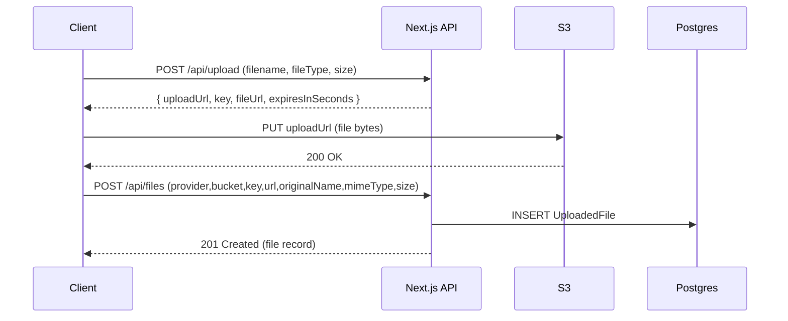

# School Management System (SMS)

Next.js (TypeScript) + Prisma + PostgreSQL + Redis starter for a school management system.

## Folder Structure

This project uses the standard Next.js + TS layout:

- `src/app` – App Router (pages/layouts/routes)
- `src/components` – UI components
- `src/lib` – shared libraries (Prisma, env, JWT, response helpers)

## Environment Variables

- Local dev file: `.env.local` (ignored)
- Template: `.env.example` (committed)

Server-only variables (do NOT prefix with `NEXT_PUBLIC_`):

- `DATABASE_URL`
- `REDIS_URL`
- `JWT_SECRET`

Client-safe variables:

- `NEXT_PUBLIC_API_BASE_URL`

## Local Development (Docker)

From the repo root:

```bash
docker-compose up -d
```

The app runs at http://localhost:3000.

## Local Development (No Docker)

```bash
cd sms
npm install
cp .env.example .env.local
npm run db:generate
npm run db:migrate
npx prisma db seed
npm run dev
```

## Scripts

```bash
npm run dev
npm run build
npm start

npm run lint
npm run format
npm run format:check
npm run typecheck

npm run db:generate
npm run db:migrate
npm run db:studio
```

## API Routes

Routes live under `src/app/api`:

- `POST /api/auth/signup`
- `POST /api/auth/login`
- `POST /api/auth/logout`
- `GET /api/projects`
- `POST /api/projects`
- `GET /api/projects/:id`
- `GET /api/tasks`
- `POST /api/tasks`
- `GET /api/tasks/:id`
- `PATCH /api/tasks/:id`
- `GET /api/users/me`

### Secure file uploads (Pre-signed S3 URLs)

New routes:

- `POST /api/upload` – generate a short-lived pre-signed **PUT** URL
- `POST /api/files` – store uploaded file metadata in Postgres

Environment variables (server-only):

- `AWS_REGION`
- `AWS_BUCKET_NAME`
- `AWS_ACCESS_KEY_ID` (optional if using IAM roles)
- `AWS_SECRET_ACCESS_KEY` (optional if using IAM roles)
- `S3_PRESIGN_TTL_SECONDS` (default: 60)
- `UPLOAD_MAX_BYTES` (default: 10MB)

#### Upload flow



#### Example API responses

Generate URL (`POST /api/upload`):

```json
{
  "success": true,
  "statusCode": 201,
  "message": "Pre-signed upload URL generated",
  "data": {
    "uploadUrl": "https://...",
    "provider": "s3",
    "bucket": "your-bucket-name",
    "key": "uploads/<userId>/<uuid>-file.pdf",
    "fileUrl": "https://your-bucket-name.s3.ap-south-1.amazonaws.com/uploads/...",
    "expiresInSeconds": 60
  }
}
```

Store record (`POST /api/files`):

```json
{
  "success": true,
  "statusCode": 201,
  "message": "File record stored successfully",
  "data": {
    "id": "cl...",
    "provider": "s3",
    "bucket": "your-bucket-name",
    "key": "uploads/...",
    "url": "https://...",
    "originalName": "file.pdf",
    "mimeType": "application/pdf",
    "size": 12345,
    "uploaderId": "cl...",
    "createdAt": "2026-01-19T...Z"
  }
}
```

#### Security measures implemented

- **Type validation**: only `image/jpeg`, `image/png`, `image/webp`, `application/pdf` are allowed before issuing a URL.
- **Size validation**: `UPLOAD_MAX_BYTES` gate prevents oversized uploads from ever receiving a pre-signed URL.
- **Short-lived URLs**: `S3_PRESIGN_TTL_SECONDS` keeps the upload URL valid briefly (recommended 30–120s).
- **No secret exposure**: clients never receive AWS credentials.

#### Lifecycle policy (recommended)

Create an S3 lifecycle rule for the `uploads/` prefix to expire or transition old files (e.g., delete after 30 days, or transition to a cheaper storage class). This reduces storage cost and limits long-term exposure of stale content.

## Redis Caching Layer (Cache-Aside)

This project uses Redis as a cache layer to reduce repeated database reads for frequently requested data.

### What’s cached

- `GET /api/users` (admin-only) caches the full API response body under a Redis key.

### TTL policy

- TTL: **60 seconds**
- Rationale: keeps data reasonably fresh while significantly reducing load/latency for repeated admin dashboard requests.

### Cache invalidation strategy

- On `POST /api/auth/signup`, the `users:list` cache key is deleted to prevent serving stale user lists.

### Where it’s implemented

- Redis client: `src/lib/redis.ts`
- Cache helpers: `src/lib/cache.ts`
- Cache keys: `src/lib/cache-keys.ts`
- Cached route: `src/app/api/users/route.ts`
- Invalidation: `src/app/api/auth/signup/route.ts`

### How to verify (hit vs miss)

1. Start services (includes Redis):

```bash
docker-compose up -d
```

2. Call `GET /api/users` twice (as an admin user).

On the first request you should see a log like:

- `Cache Miss - Fetching from DB`

On the second request (within 60 seconds):

- `Cache Hit`

If Redis is unavailable, requests still succeed (cache gracefully falls back to DB).

## Docs

- `API_DOCUMENTATION.md`
- `DATABASE_SCHEMA.md`
- `DEVELOPMENT_SETUP.md`
- `BRANCHING_STRATEGY.md`
